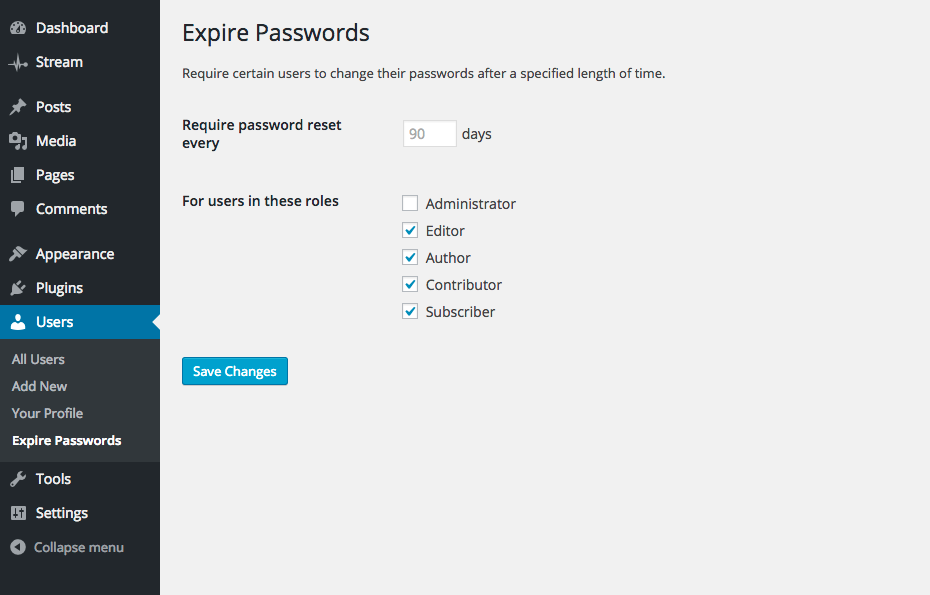
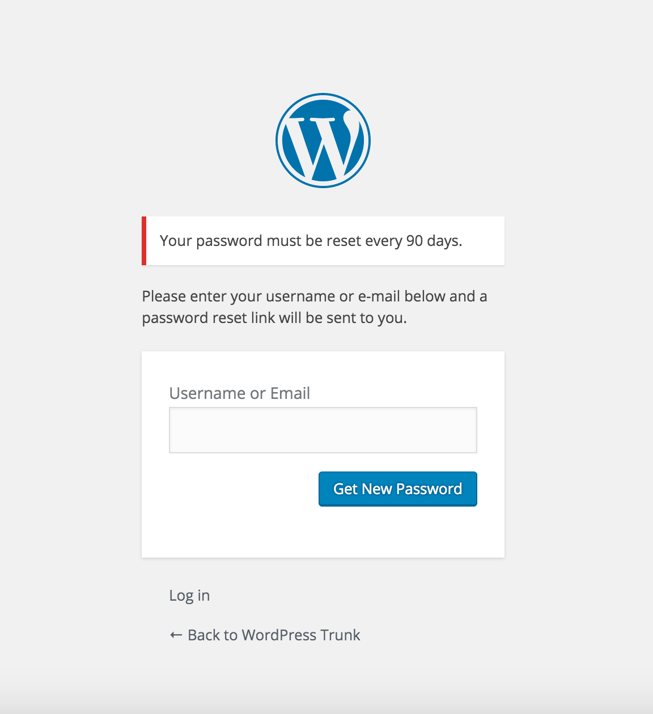
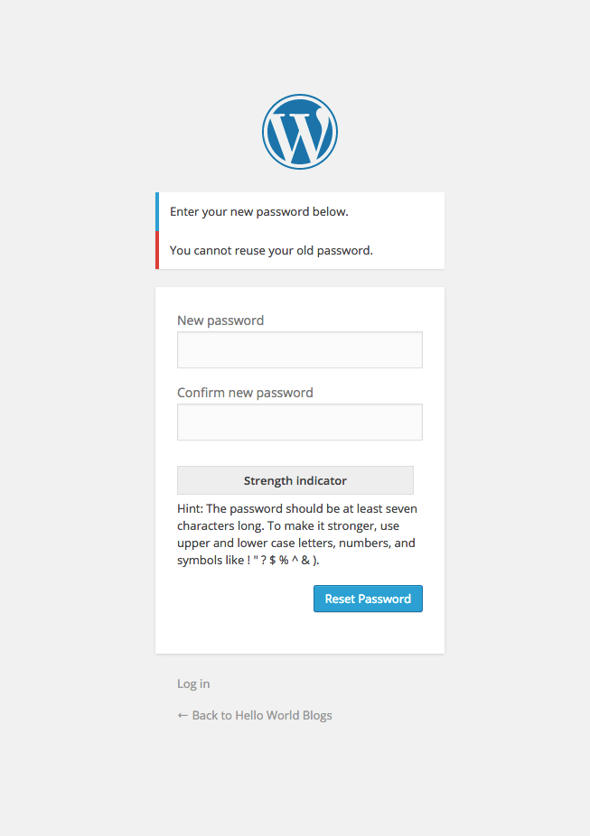

<!-- DO NOT EDIT THIS FILE; it is auto-generated from readme.txt -->
# Expire Passwords

Require certain users to change their passwords on a regular basis.

**Contributors:** [fjarrett](https://profiles.wordpress.org/fjarrett)  
**Tags:** [admin](https://wordpress.org/plugins/tags/admin), [login](https://wordpress.org/plugins/tags/login), [membership](https://wordpress.org/plugins/tags/membership), [passwords](https://wordpress.org/plugins/tags/passwords), [profile](https://wordpress.org/plugins/tags/profile), [security](https://wordpress.org/plugins/tags/security), [users](https://wordpress.org/plugins/tags/users)  
**Requires at least:** 3.7  
**Tested up to:** 4.2  
**Stable tag:** 0.2.2  
**License:** [GPLv3](https://www.gnu.org/licenses/gpl-3.0.html)  

 

## Description ##

**Did you find this plugin helpful? Please consider [leaving a 5-star review](https://wordpress.org/support/view/plugin-reviews/expire-passwords).**

Harden the security of your site by preventing unauthorized access to stale user accounts.

This plugin is also ideal for sites needing to meet certain industry security compliances - such as government, banking or healthcare.

In the plugin settings you can set the maximum number of days users are allowed to use the same password (90 days by default), as well as which user roles will be required to reset their passwords regularly (non-Administrators by default).

**Languages supported:**

* English
* Español

**Development of this plugin is done [on GitHub](https://github.com/fjarrett/expire-passwords). Pull requests welcome. Please see [issues reported](https://github.com/fjarrett/expire-passwords/issues) there before going to the plugin forum.**

## Screenshots ##

### Configure which user roles should be required to regularly reset their passwords and how often.

### Users with expired passwords are redirected to the password reset screen upon sign in.

### Users are not permitted to use the same password two times in a row during reset.

## Changelog ##

### 0.2.2 - July 2, 2015 ###
* New: Language support for Español

Props [@fjarrett](https://github.com/fjarrett)

### 0.2.1 - July 2, 2015 ###
* Fix: Fatal undefined function error occuring in some cases ([#3](https://github.com/fjarrett/expire-passwords/issues/3))

Props [@fjarrett](https://github.com/fjarrett)

### 0.2.0 - April 29, 2015 ###
* New: Disallow using the same password as before on reset ([#1](https://github.com/fjarrett/expire-passwords/issues/1))
* Tweak: Use default if limit is set to greater than 365 days

Props [@fjarrett](https://github.com/fjarrett)

### 0.1.0 - April 28, 2015 ###
* Initial release

Props [@fjarrett](https://github.com/fjarrett)

